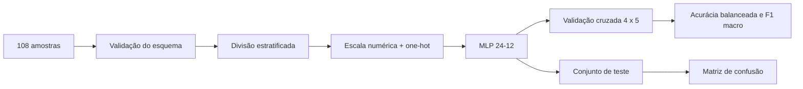
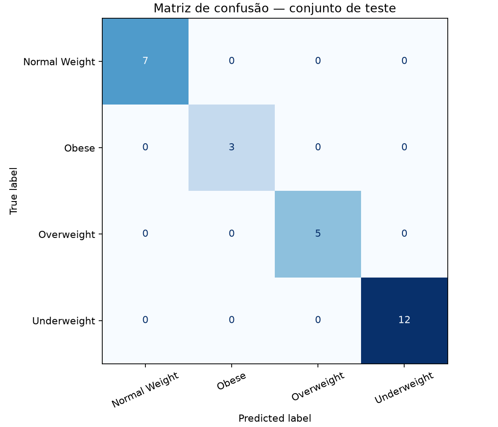

# Classificação de obesidade com rede neural MLP

[](https://github.com/r-menegueli/classificacao-obesidade-mlp/actions/workflows/ci.yml)


Projeto acadêmico de classificação multiclasse com Python e scikit-learn. O modelo prevê `Underweight`, `Normal Weight`, `Overweight` e `Obese` a partir de idade, gênero, altura e peso.

## Pipeline



## Resultados reproduzíveis

| Métrica na validação cruzada | Média | Desvio-padrão |
| --- | ---: | ---: |
| Acurácia | 93,70% | 5,25% |
| Acurácia balanceada | 92,90% | 6,72% |
| F1 macro | 92,45% | 6,72% |



O `holdout` de 27 amostras foi classificado integralmente, mas a validação cruzada repetida é a estimativa mais confiável por aproveitar diferentes divisões do conjunto pequeno.

## Decisões de modelagem

- caminho do CSV portátil;
- divisão estratificada e semente fixa;
- pré-processamento dentro do pipeline para evitar vazamento entre treino e teste;
- variáveis numéricas padronizadas e gênero codificado com `OneHotEncoder`;
- MLP com camadas ocultas de 24 e 12 neurônios;
- BMI removido das entradas, pois praticamente define a classe e inflaria artificialmente o resultado;
- métricas e previsões gravadas em formatos abertos.

## Execução

```bash
python -m pip install -r requirements.txt
python analise_obesidade.py
```

Os resultados são atualizados em `resultados/`. A integração contínua executa o pipeline e verifica a estrutura das métricas a cada `push` e `pull request`.

## Limitações

O conjunto possui somente 108 amostras e é desbalanceado. O projeto demonstra engenharia de atributos e avaliação de modelos; **não deve ser utilizado para diagnóstico ou orientação médica**.
